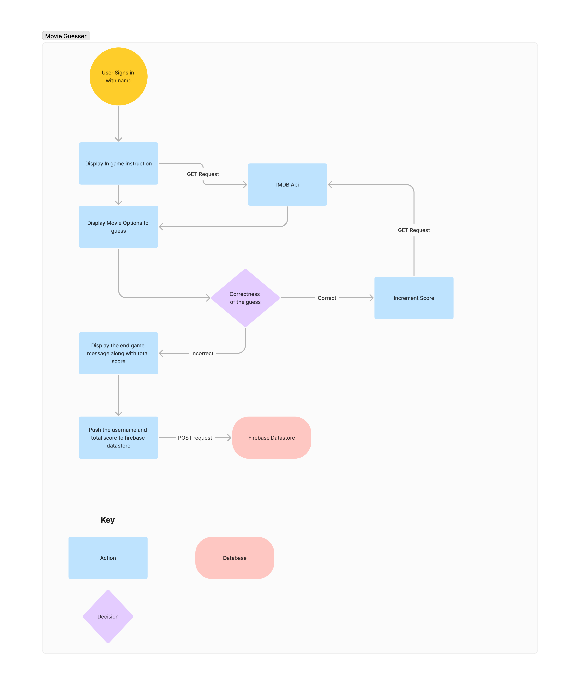

# Movie-Guesser

This is a simple app to guess which of the two movies displyed got higher box office collection.
Built using react, the app queries the imdb api for movie information. Data is stored in firebase datastore.

To run it locally,
1. clone the repository
2. to run the web app <br>
```cd client``` <br>
```npm install``` <br>
```npm run start``` <br>
3. to convert it into android app <br>
```npm install ionic``` <br> 
```npm install capacitor``` <br>
```ionic capacitor add android``` <br>
```npx cap open android``` <br>
4. this will open the react project in android studio, you can build the app and then later bundle the code into an apk <br>

Enjoy !

Incorporating Multiplayer Setup: Add a multiplayer mode where users can compete against friends or other players in real-time
Customization: Allow users to customize the game settings, such as the number of rounds or the difficulty level.

Architecture of the app

